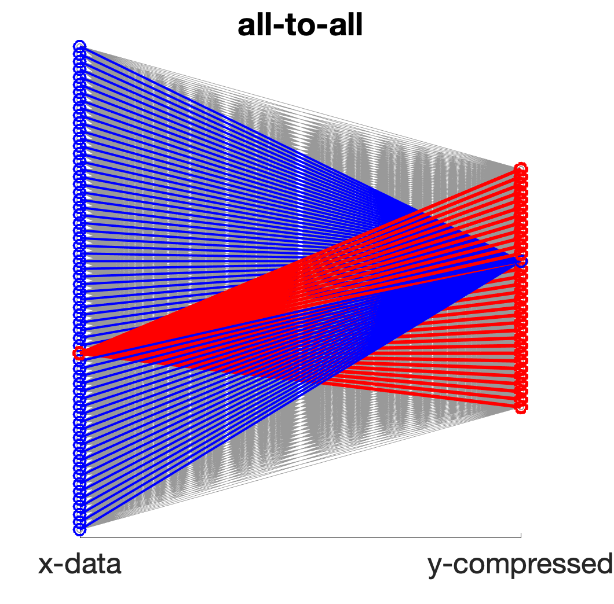
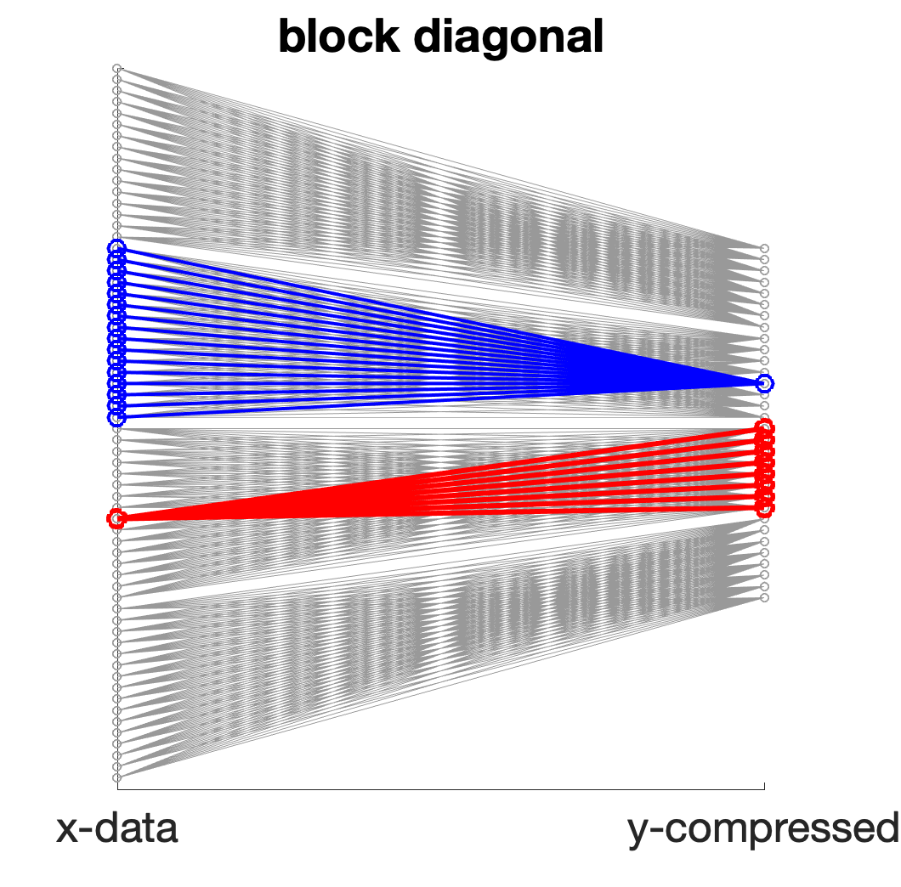
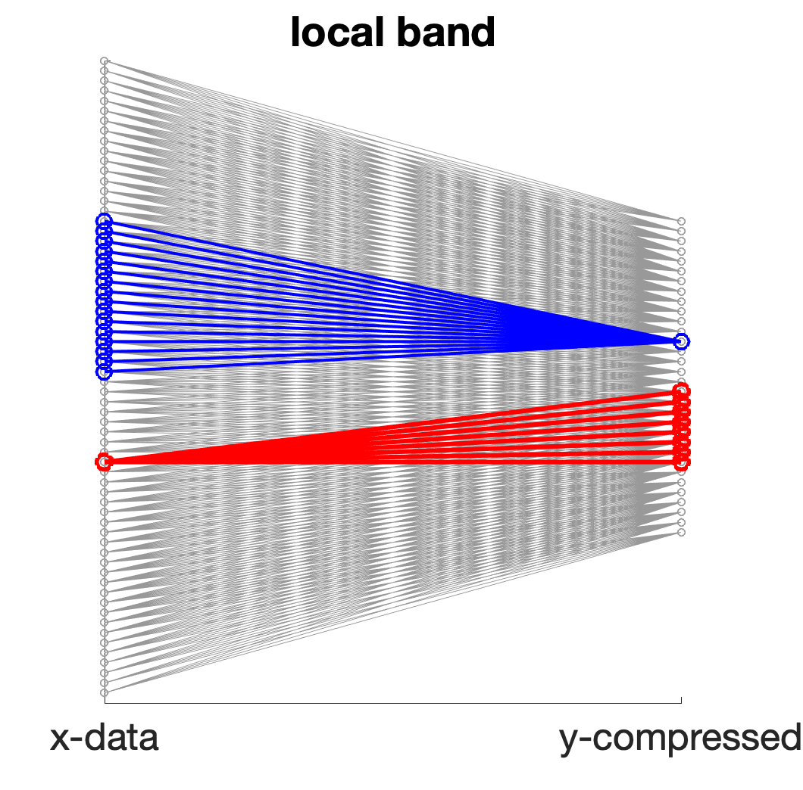

# Localized Sparse Coding

<p align="center">



</p>


### Background
*Learning sparse codes from compressed representations with biologically plausible local wiring constraints*

Code accompanying 2020 NeurIps paper by Kion Fallah<sup>\*</sup>, Adam A. Willats<sup>\*</sup>, Ninghao Liu, and Christopher J. Rozell.

This library provides code to learn a sparse coding model with different coefficient inference strategies (FISTA and ADMM), as well as different compression schemes (dense random, block diagonal matrix, and banded random matrix).

<sub>\* equal contribution </sub>
### Usage
#### Training
In order to train a compressed sparse dictionary, use the `train_sparse_dict.py` script. There are several optional parameters, but the ones that you might be interested in are:
 
* `--compression` or `-c`, which determines the compression matrix. Options are `none` for no compression, `dbd` for distinct block diagonal, and `brm` for banded random matrix.
* `--localization` or `-l`, which determines the degree of localization

Example usage:
```
python train_sparse_dict.py -c bdm -l 4
```

#### Dependencies
Python 3.0+, Scikit-Learn, Numpy, Scipy. 

### Examples

#### Output
The training script, `train_sparse_dict.py`, outputs a dictionary containing Numpy arrays in a specific format. To use it, first load a training file:

```python
data_file = np.load('./results/traindata_05-31-2020_none_J1.npz')
```

With any training file loaded, access the dictionary using the following format:


| Dictionary key          | Value                                                                                                                                                                                                                         |
|-------------------------|-----------------------------------------------------------------------------------------------------------------------------------------------------------------------------------------------------------------------------------|
| data_file['phi']        | A Numpy tensor containing the dictionary at each epoch in training. Dimensions [num_epochs x patch_size**2 x dict_count]                                                                                                          |
| data_file['time']       | The training time, in seconds, at each epoch Dimensions [num_epochs x float]                                                                                                                                                      |
| data_file['train_loss'] | Training loss at each epoch. Performed on uncompressed or compressed dictionaries learned on the main data-set.   Loss is MSE reconstructing training patches. Dimensions [num_epochs x float].                                   |
| data_file['val_loss']   | Validation loss at each epoch. Performed on uncompressed or reconstructed dictionaries on hold-out data-set,   taken from seperate images. Loss is MSE between reconstructed validation patches. Dimensions [num_epochs x float]. |

#### Uncompressed
<p align="center">

</p>

#### Distinct Block Diagonal Matrix, L = 1/4
<p align="center">

</p>

#### Banded Random Matrix, L = 1/4
<p align="center">

</p>
