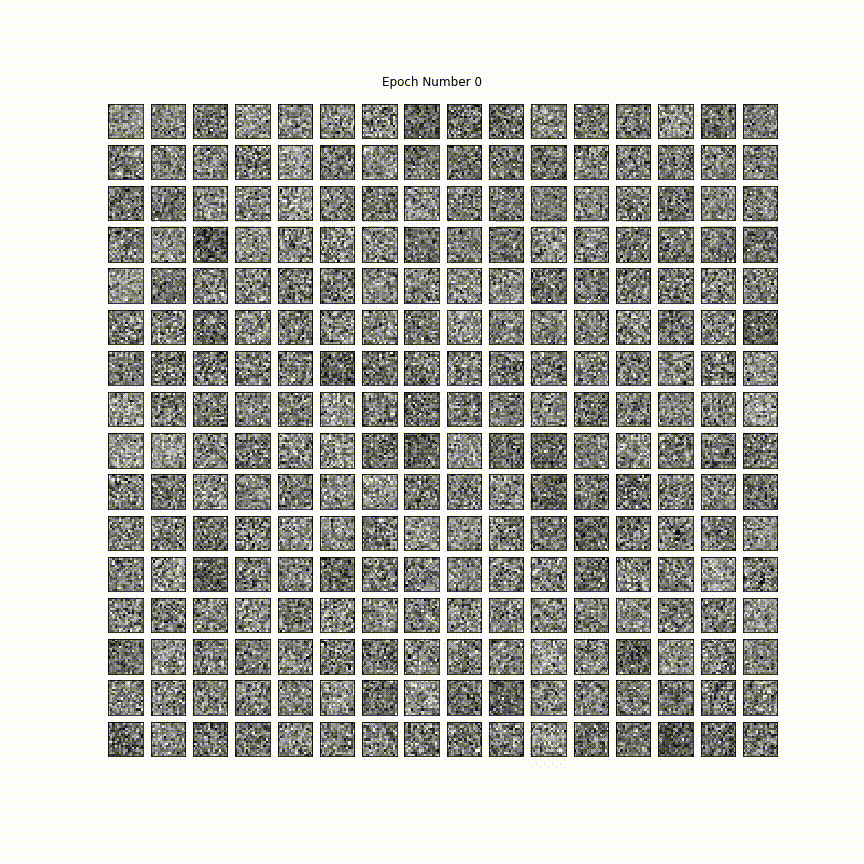
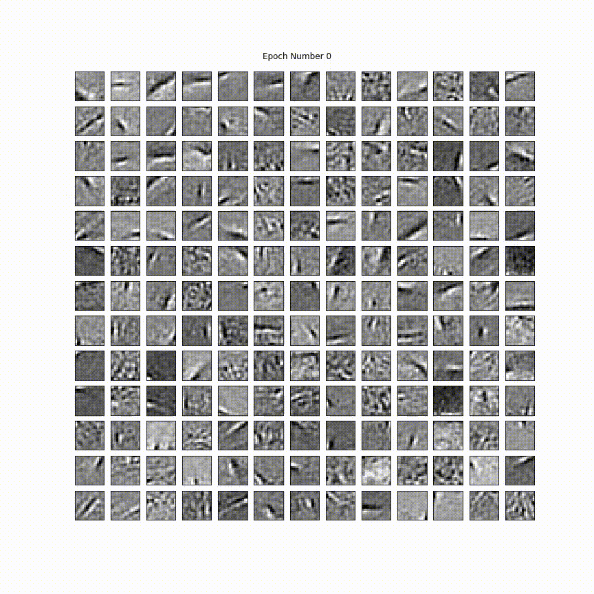
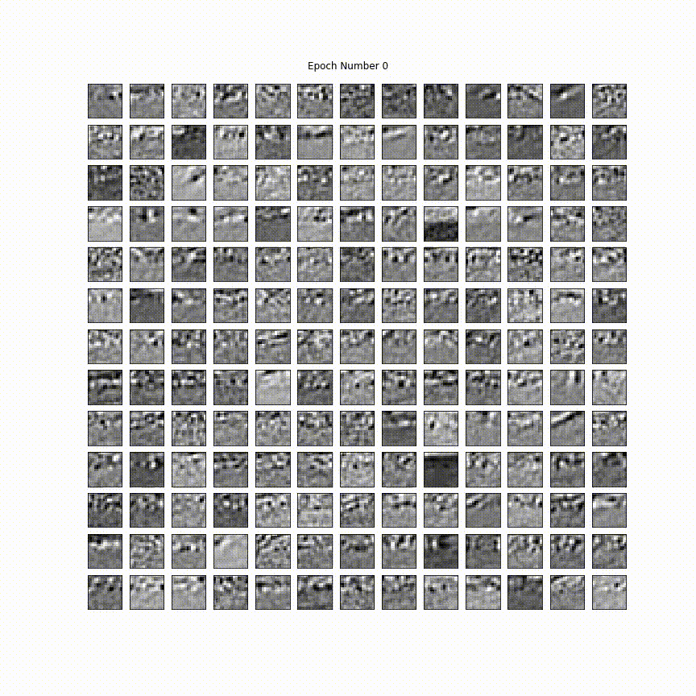

# Compressed Sparse Dictionary

### Background

< Have Chris give a brief background on the project>

### Usage
#### Training
In order to train a compressed sparse dictionary, use the `train_sparse_dict.py` script. There are several optional parameters, but the ones that you might be interested in are:
 
* `--compression` or `-c`, which determines the compression matrix
* `--localization` or `-j`, which determines the degree of localization

Example usage:
```
python train_script_dict.py -c dbd -j 4
```
#### Analysis
To analyse included pre-trained data, use data_plotting.ipynb. This is a python notebook that requires Jupyter to interact with.

#### Dependencies
Python 3.0+, Scikit-Learn, Numpy, Scipy

### Examples

#### Uncompressed
<p align="center">

</p>

#### Distinct Block Diagonal Matrices
<p align="center">

</p>

#### Banded Diagonal Matrices
<p align="center">

</p>